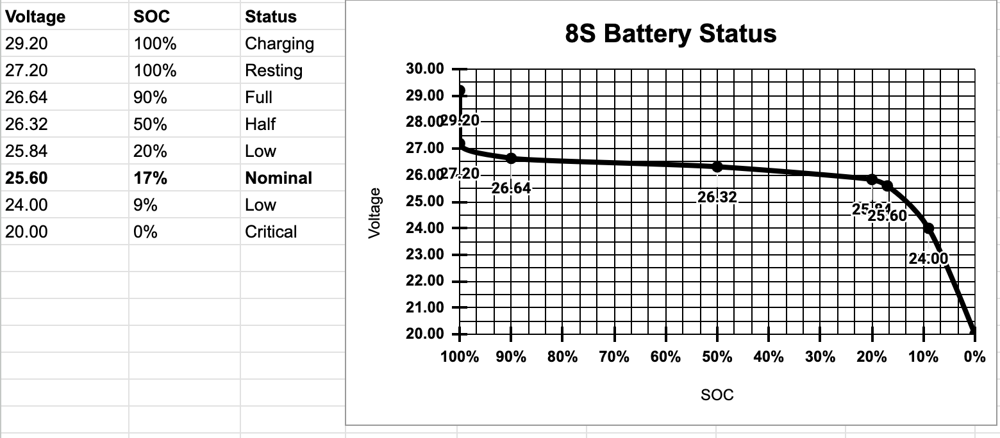

# Battery Monitor (Arduino Nano)

A voltage monitoring system for LiFePO₄ battery packs.

## Features
- Measures pack voltage using ADC
- Displays voltage and SOC on OLED
- Low-voltage alarm with buzzer
- Configured for 16S LiFePO₄ battery systems

## Hardware
- Arduino Nano
- SSD1306 OLED display
- Passive buzzer

[PDF 8S LFP Porfile](./resources/LiFePO4%20Profiles%20-%2025.6V%20(8S).pdf)

